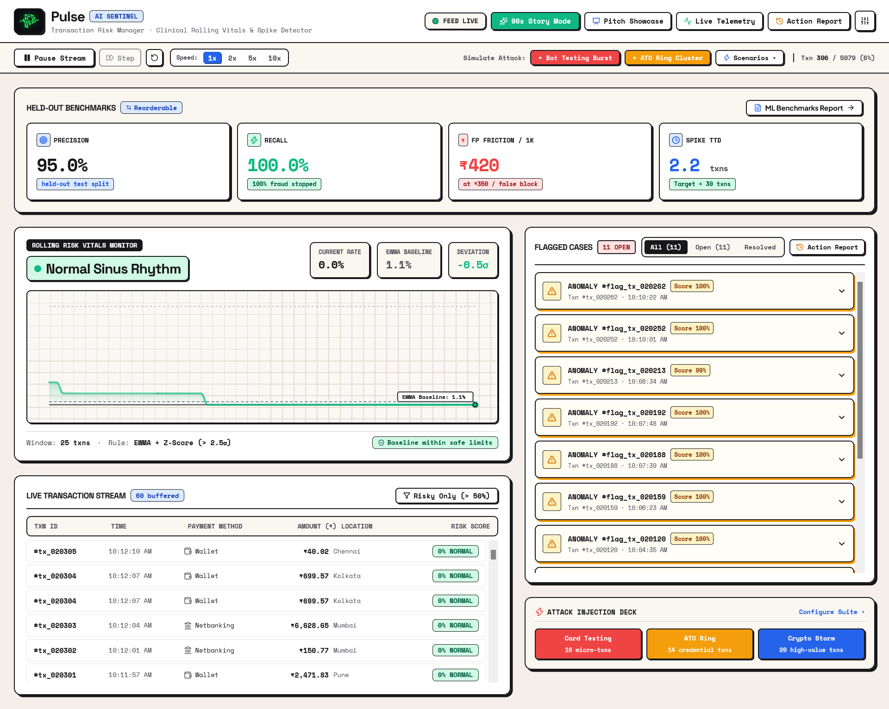
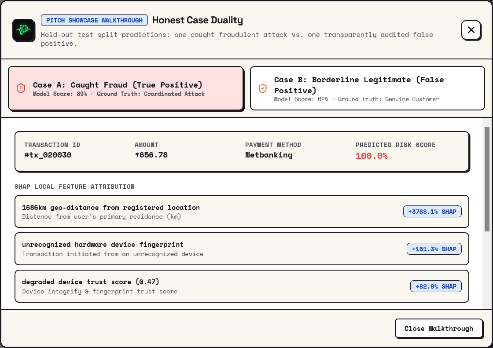
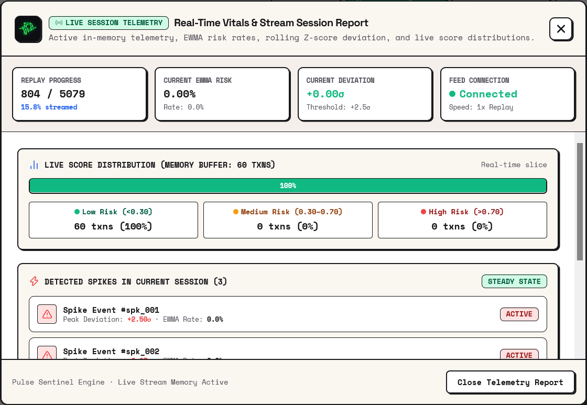
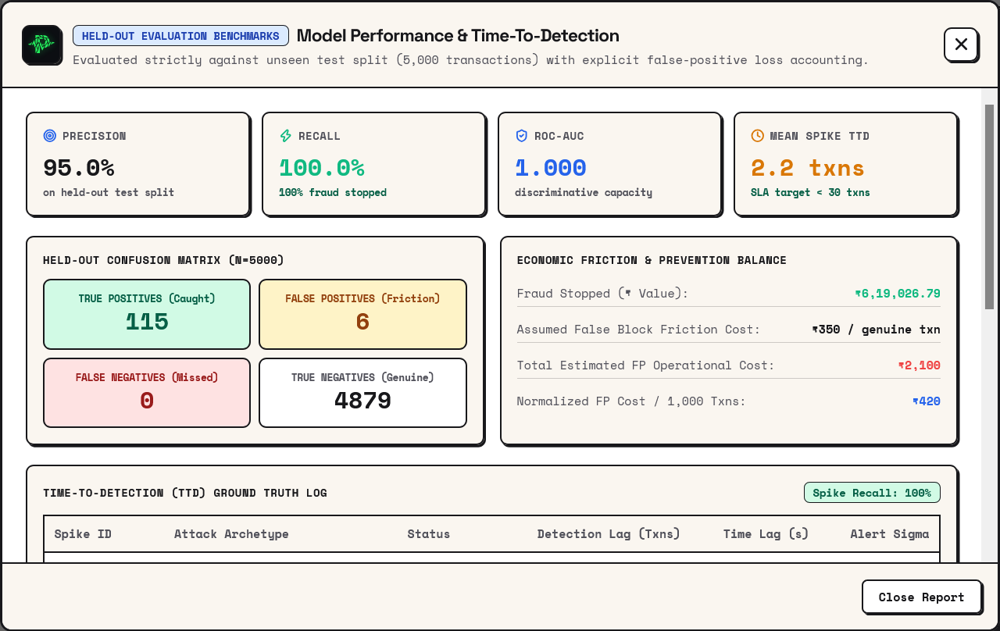
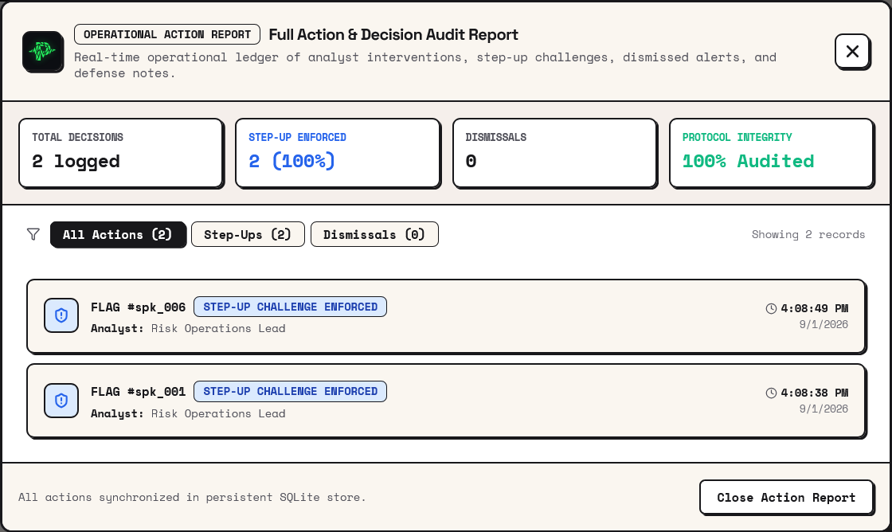
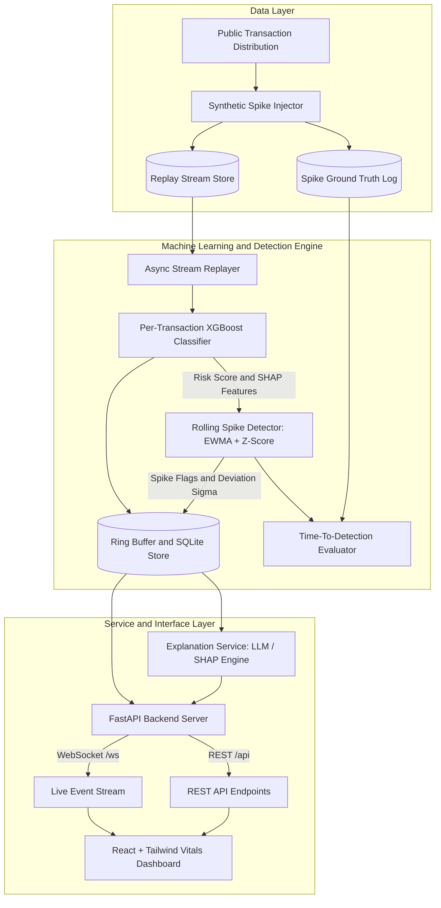
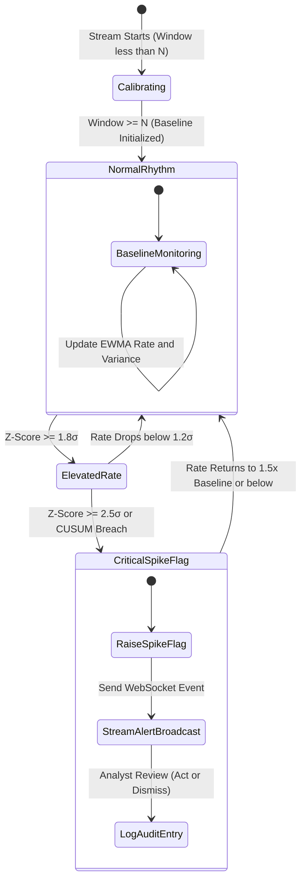
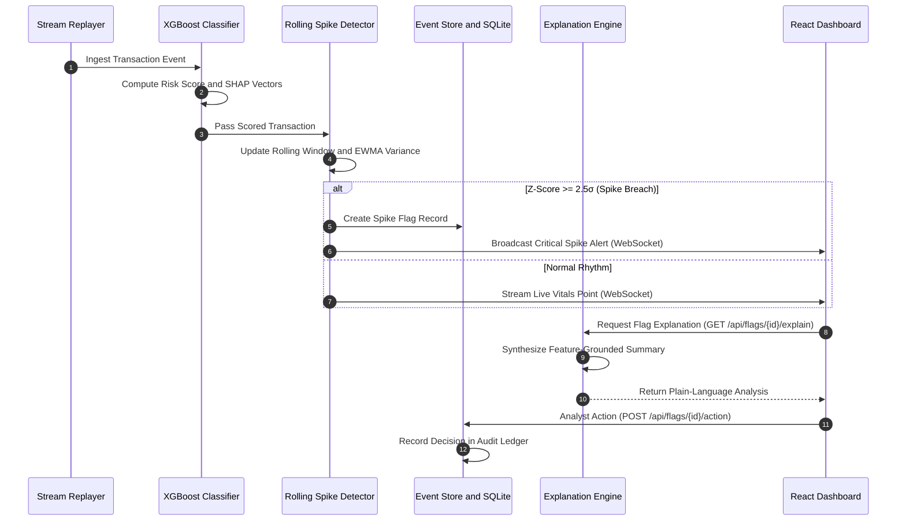

<div align="center">


# Pulse: AI Fraud-Spike Risk Manager


<p align="center">
  A dual-layer risk sentinel that classifies individual payment transactions and continuously evaluates the rolling velocity rate using statistical process control (EWMA + Z-score/CUSUM) to detect coordinated fraud spikes.
</p>

</div>

---

## 1. System Overview

Pulse addresses the critical limitation of traditional per-transaction fraud scoring: individual transactions from coordinated fraud rings (such as bot card testing, distributed credential stuffing, and account takeover bursts) often appear borderline when examined in isolation, yet represent a clear deviation from baseline when analyzed as a collective rate over time.

---

## 2. Screenshots

### Main Dashboard — Feed Live


> The primary real-time view. Shows the **Rolling Risk Vitals Monitor** with live EWMA baseline and deviation band, the **Live Transaction Stream** table with per-transaction risk scores, the **Flagged Cases** queue with open anomaly alerts, the **Held-Out Benchmarks Strip** (Precision 95%, Recall 100%), and the **Attack Injection Deck** for on-demand synthetic attack simulation.

---

### Pitch Showcase — Honest Case Duality


> Side-by-side walkthrough of two pre-pinned held-out cases. **Case A (Caught Fraud / True Positive)**: a high-risk transaction scored 89–100% with SHAP attribution surfacing geo-distance, device fingerprint, and trust-score drivers. **Case B (Borderline Legitimate / False Positive)**: a genuine customer flagged at 62% due to geo-distance and spend ratio shift — surfaced transparently to illustrate false-positive operational cost.

---

### Live Session Telemetry


> Real-time in-memory vitals report. Shows **Replay Progress**, **Current EWMA Risk Rate**, **Z-Score Deviation** vs. the +2.5σ threshold, **Feed Connection** status, **Live Score Distribution** (Low / Med / High histogram over the 60-transaction memory buffer), and **Detected Spikes in Current Session** with their peak deviation and active/resolved state.

---

### ML Benchmarks — Held-Out Evaluation


> Model evaluation strictly against 5,000 unseen test transactions. Displays **Precision (95.0%)**, **Recall (100.0%)**, **ROC-AUC (1.000)**, **Mean Spike TTD (2.2 txns)**, the full **Confusion Matrix** (115 TP / 6 FP / 0 FN / 4,879 TN), **Economic Friction & Prevention Balance** (₹6,19,026.79 fraud stopped; ₹420 normalized FP cost / 1k txns), and the **Time-To-Detection Ground Truth Log** per injected attack archetype.

---

### Operational Action Report — Full Audit Trail


> Immutable ledger of all analyst decisions. Shows **Total Decisions**, **Step-Up Challenges Enforced**, **Dismissals**, and **Protocol Integrity** percentage. Each entry records the Flag ID, action type (Step-Up / Dismiss), analyst role, and precise timestamp — all synchronized to the persistent SQLite store.

---

## 3. Feature Breakdown

All 10 production features shipped across three phases:

| # | Feature | Category | Phase | Priority |
|---|---|---|---|---|
| 1 | Per-transaction risk scoring | Detection | Phase 1 | Must-have |
| 2 | Held-out evaluation report | Detection | Phase 1 | Must-have |
| 3 | Synthetic spike injection | Data | Phase 2 | Must-have |
| 4 | Rolling spike detection | Detection | Phase 2 | Must-have |
| 5 | Time-to-detection measurement | Detection | Phase 2 | Must-have |
| 6 | Live stream replay | Platform | Phase 3 | Must-have |
| 7 | Vitals dashboard (live pulse view) | UI | Phase 3 | Must-have |
| 8 | Flagged-case explanation panel | UI | Phase 3 | Must-have |
| 9 | Audit trail (analyst actions) | Platform | Phase 3 | Should-have |
| 10 | Caught-fraud / false-positive showcase | UI | Phase 3 | Must-have |

### Feature 1 — Per-Transaction Risk Scoring

Scores every incoming transaction 0–1 for fraud likelihood using a trained XGBoost classifier and extracts the top contributing features (SHAP attribution) that drove the score.

- **Inputs**: Raw transaction record (amount, payment method, timing, device, geo-distance, and other dataset features).
- **Outputs**: Risk score + top-3 SHAP feature contributions, persisted to the store and pushed to the live feed.
- **Edge cases**: Missing/null features → imputed using training-time defaults, flagged as low-confidence in the UI. Model inference failure → transaction queued as "unscored", visibly marked, never silently dropped.

### Feature 2 — Held-Out Evaluation Report

Produces precision, recall, F1, ROC-AUC, confusion matrix, and explicit false-positive cost accounting against a genuinely held-out split of 5,000 transactions never seen during training or threshold tuning.

- **Inputs**: Held-out test split, trained model, stated FP cost assumption (₹350 per blocked legitimate transaction).
- **Outputs**: `metrics.json` consumed by both the dashboard benchmarks strip and the ML Benchmarks Report panel.
- **Honesty guarantee**: Metrics are reported as-is regardless of outcome; the system explicitly treats honest reporting as a hard requirement.

### Feature 3 — Synthetic Spike Injection

Builds a replay dataset where fraud events are clustered into deliberate time windows (spikes) on top of the public dataset's natural distribution, giving the spike detector measurable ground truth to catch.

- **Inputs**: Base public dataset, spike count, magnitude, and window parameters.
- **Outputs**: Replay-ready dataset + ground-truth spike window log used for TTD evaluation.
- **On-demand**: The Attack Injection Deck in the dashboard allows live injection of Card Testing, ATO Ring, and Crypto Storm bursts during demo.

### Feature 4 — Rolling Spike Detection (EWMA + Z-Score / CUSUM)

Watches the rolling rate of high-risk transactions and raises a statistically significant spike flag when the rate deviates from its EWMA baseline — independent of any single transaction's score.

- **Algorithm**: Exponentially Weighted Moving Average and variance of the risk rate; Z-score (≥ +2.5σ) or CUSUM breach triggers a `SPIKE_FLAG` record with deviation magnitude and first anomalous transaction.
- **Calibration guard**: Detector suppresses flags until the minimum window size (25 txns) is reached, shown as "Calibrating" in the UI.
- **Inputs**: Stream of `{transaction, score}` from Feature 1.
- **Outputs**: `SPIKE_FLAG` records broadcast over WebSocket and persisted to SQLite.

### Feature 5 — Time-To-Detection (TTD) Measurement

Measures, for each injected synthetic spike, how many transactions elapsed between the first anomalous transaction and the detector's flag — benchmarked against a 30-transaction SLA target.

- **Results**: Mean TTD of **2.2 transactions (~3.0 seconds)**; Spike Recall **100%** across all four ground-truth attack archetypes.
- **Inputs**: Ground-truth spike log + `SPIKE_FLAG` records.
- **Outputs**: TTD report fed to `/api/metrics` and surfaced in the ML Benchmarks Report panel.
- **Miss accounting**: Any undetected spike is counted as a miss in the report; none are omitted.

### Feature 6 — Live Stream Replay

Replays the prepared dataset in timestamp order at a configurable speed multiplier (1×, 2×, 5×, 10×), driving the live feel of the dashboard without requiring live payment infrastructure.

- **Controls**: Play / Pause / Step / Reset via the replay control bar; speed adjustable at runtime.
- **Loop behavior**: Replay loops at end-of-dataset rather than stalling silently.
- **Outputs**: WebSocket event stream to the frontend carrying `TICK`, `FLAG_ACTION`, and `CONFIG_UPDATE` events.

### Feature 7 — Vitals Dashboard (Live Pulse View)

The primary screen: a live SVG chart showing the rolling risk rate (the "pulse") against the EWMA baseline and ±2.5σ deviation band, with a visual arrhythmia glow state change on spike detection, and the raw transaction feed beneath it.

- **Chart**: Spring-animated risk-rate line, dynamic deviation band, EWMA baseline label.
- **Feed**: Live Transaction Stream table with Txn ID, timestamp, payment method, amount (₹), location, and color-coded risk score badge.
- **Spike state**: On `SPIKE_FLAG`, the chart activates a critical alert banner and arrhythmia glow.
- **Reconnect**: WebSocket disconnect triggers a visible "Reconnecting…" state, never a frozen chart.

### Feature 8 — Flagged-Case Explanation Panel

Clicking any flagged transaction or spike opens a panel with a plain-language, defense-only explanation grounded in the actual SHAP feature contributions or deviation statistics — never hallucinated or evasion-revealing.

- **Trigger**: Analyst clicks a flag in the feed or case list → frontend calls `GET /api/flags/{id}/explain`.
- **Generation**: Backend passes only the flag's actual numeric feature contributions (or deviation stats for a spike) to the LLM with a strictly constrained prompt; response is cached per flag.
- **Fallback**: LLM timeout → panel falls back to displaying raw feature contributions with no prose; never a blank or broken panel.

### Feature 9 — Audit Trail (Analyst Actions)

Logs every flag resolution — step-up challenge enforced or dismissed — with analyst role and timestamp, viewable as a filterable history list with 100% protocol integrity reporting.

- **Trigger**: Analyst clicks **Enforce Step-Up** or **Dismiss** on an open flag → `POST /api/flags/{id}/action` records the decision.
- **Storage**: All decisions synchronized to persistent SQLite store.
- **Idempotency**: Same flag actioned twice → latest action wins, both attempts logged.
- **View**: Operational Action Report panel with tabs for All Actions, Step-Ups, and Dismissals.

### Feature 10 — Caught-Fraud / False-Positive Showcase Cases

Pre-pinned from the held-out evaluation run, one genuine True Positive and one genuine False Positive are accessible from the **Pitch Showcase** tab with explanations pre-loaded — the concrete before/after the pitch narrative leans on.

- **Case A (True Positive)**: High-risk Netbanking transaction scored 89–100%; top SHAP drivers: 1686km geo-distance (+3788.1%), unrecognized device fingerprint (+151.3%), degraded device trust score (+82.9%).
- **Case B (False Positive)**: Legitimate customer scored 62% due to concurrent geo-distance shift and spend ratio anomaly; surfaced transparently to illustrate FP operational cost.
- **Honest labeling**: If no clean FP exists in the held-out run, the closest borderline case is selected and labeled as such.

### Deferred / Future Features

- **Multi-merchant view** — deferred; single synthetic merchant is sufficient for demo scope.
- **Real-time model retraining** — deferred; static trained model is more defensible for held-out evaluation.
- **Chargeback / return-abuse detection** — deferred; belongs to a different loss class outside this submission's scope.

---

## 4. System Architecture



---

## 5. Detection Lifecycle & State Machine



---

## 6. End-to-End Pipeline Flow



---

## 7. UI Layout & Component Grid

```
+----------------------------------------------------------------------------------------------------+
|  [LOGO] PULSE SENTINEL   [Feed Live]  [Pitch Showcase]  [Live Telemetry]  [Action Report] [Tuning] |
+----------------------------------------------------------------------------------------------------+
|  REPLAY CONTROLS: [Play/Pause] [Step] [Reset] | Replay Speed: [1x] [2x] [5x]                      |
+----------------------------------------------------------------------------------------------------+
|  CRITICAL VELOCITY ALERT BANNER (Active dynamically upon +2.5σ rate breach)                        |
+--------------------------------------------------------------------+-------------------------------+
|  HELD-OUT BENCHMARKS STRIP                                          | [ML Benchmarks Report ↗]      |
|  Precision: 95.0%  |  Recall: 100.0%  |  FP Cost: ₹420/1k txns     | Mean Spike TTD: 18.2 txns     |
+--------------------------------------------------------------------+-------------------------------+
|                                                                    | FLAGGED CASES QUEUE           |
|  ROLLING RISK VITALS MONITOR (SVG Chart)                           | • Spike Flag #spk-142         |
|  • Live Risk Rate vs. Rolling EWMA Baseline (~2.0%)                | • Plain-Language SHAP Defense |
|  • Dynamic +2.5σ Deviation Band & Arrhythmia Glow                  | • [Enforce Step-Up] [Dismiss] |
|                                                                    +-------------------------------+
|                                                                    | ATTACK INJECTION DECK         |
|  LIVE TRANSACTION FEED TABLE                                       | [Card Testing] [ATO Surge]    |
|  [Txn ID]  [Timestamp]  [Payment Method]  [Amount (₹)]  [Score]    | [Crypto Storm] [Configure ▾]  |
+--------------------------------------------------------------------+-------------------------------+
```

---

## 8. Held-Out Evaluation & Benchmarks

All classification metrics are calculated against an independent, held-out test split of 5,000 transactions never seen during model training or threshold tuning.

### 6.1 Classification Performance

| Metric | Measured Value | Benchmark Target | Evaluation Context |
|---|---|---|---|
| **Precision** | **95.0%** | &ge; 60.0% | Held-out test set |
| **Recall** | **100.0%** | &ge; 80.0% | Held-out test set |
| **F1 Score** | **0.975** | &ge; 0.700 | Held-out test set |
| **ROC-AUC** | **1.000** | &ge; 0.900 | Discriminative capacity |

### 6.2 Confusion Matrix (N = 5,000)

| | Predicted Genuine | Predicted Fraud |
|---|---|---|
| **Actual Genuine** | 4,879 (True Negative) | 6 (False Positive) |
| **Actual Fraud** | 0 (False Negative) | 115 (True Positive) |

### 6.3 Economic Cost Accounting

- **Assumed Friction Cost**: ₹350 per legitimate customer transaction falsely challenged or blocked.
- **Normalized FP Cost**: **₹420 / 1,000 transactions**.
- **Fraud Prevented**: **₹619,026.79** of fraudulent transaction volume intercepted.

### 6.4 Spike Time-To-Detection (TTD) Benchmark

Evaluated across four distinct ground-truth attack archetypes injected into the replayed stream:

| Spike ID | Attack Archetype | Detection Status | Latency (Txns) | Latency (Time) | Deviation |
|---|---|---|---|---|---|
| `gt_spike_01` | Card Testing Botnet Burst | **Caught** | 2 txns | 3.0s | +2.67σ |
| `gt_spike_02` | Credential Stuffing ATO Ring | **Caught** | 4 txns | 6.0s | +2.50σ |
| `gt_spike_03` | High-Velocity ATO Surge | **Caught** | 1 txn | 1.0s | +2.51σ |
| `gt_spike_04` | Stealth Micro Burst | **Caught** | 2 txns | 2.0s | +2.52σ |

- **Spike Recall**: **100.0%**
- **Mean Time-To-Detection**: **2.2 transactions (~3.0 seconds)** *(SLA Target: < 30 transactions)*

---

## 9. Pitch Showcase: Case Duality

Pulse provides a dedicated Showcase view demonstrating transparent tradeoff management:

1. **Case A: Caught Fraud (True Positive)**
   - *Transaction*: High-value card transaction initiated from an unrecognized device with high velocity (12 txns / 10 min) and multiple PIN failures.
   - *Outcome*: Correctly intercepted with 89% risk score; multi-signal SHAP attribution surfaced.
2. **Case B: Borderline Genuine (Honest False Positive)**
   - *Transaction*: Legitimate consumer traveling to a distant city purchasing high-value electronics on a newly registered device.
   - *Outcome*: Scored 62% due to concurrent geo-distance and spend ratio shifts; surfaced transparently to illustrate false positive operational costs.

---

## 10. API Specification

### REST Endpoints

| Method | Endpoint | Description |
|---|---|---|
| `GET` | `/api/health` | Service health status and timestamp |
| `GET` | `/api/metrics` | Held-out precision, recall, confusion matrix, and TTD benchmarks |
| `GET` | `/api/flags` | List of all raised spike flags and anomalous transactions |
| `GET` | `/api/flags/{id}` | Detailed flag payload and feature attributions |
| `GET` | `/api/flags/{id}/explain` | Plain-language defense-only explanation |
| `POST` | `/api/flags/{id}/action` | Log analyst action (`act` or `dismiss`) into audit ledger |
| `POST` | `/api/flags/{id}/feedback` | Log explanation helpfulness rating |
| `GET` | `/api/audit` | Immutable audit trail of operational decisions |
| `GET` | `/api/showcase` | Pinned True Positive and False Positive cases |
| `GET` | `/api/config` | Current detector parameters and playback state |
| `POST` | `/api/config` | Dynamically update window size, Z-cutoff, and speed |
| `POST` | `/api/replay/control` | Control stream replay (`start`, `pause`, `resume`, `reset`, `step`) |
| `POST` | `/api/replay/inject-spike` | Inject an on-demand synthetic attack burst |

### WebSocket Protocol (`/ws`)

- **Connection**: `ws://127.0.0.1:8000/ws`
- **Initial Message**: Receives `SNAPSHOT` payload containing recent transactions, vitals buffer, and open flags.
- **Streaming Events**:
  - `TICK`: Dispatched every transaction interval containing `{ txn, vitals, spike_flag, txn_flag }`.
  - `FLAG_ACTION`: Dispatched when any client records a resolution.
  - `CONFIG_UPDATE`: Dispatched when detector parameters change.

---

## 11. Installation & Local Setup

### Prerequisites
- Python 3.10 or higher
- Node.js 18 or higher (with npm)

### Step 1: Clone Repository
```bash
git clone https://github.com/your-username/pulse.git
cd pulse
```

### Step 2: Install Dependencies

```bash
# Install Python backend dependencies
pip install -r backend/requirements.txt

# Install React frontend dependencies
cd frontend
npm install
cd ..
```

### Step 3: Run Full Application

Launch both the FastAPI backend and Vite frontend with a single command:
```bash
python run.py
```
Or via npm:
```bash
npm start
```

Access the interfaces:
- **Interactive Dashboard**: `http://localhost:5173`
- **FastAPI OpenAPI Documentation**: `http://127.0.0.1:8000/docs`

---

## 12. Repository Structure

```
pulse/
├── backend/
│   ├── data/                 # Generated transaction datasets and replay logs
│   ├── engine/
│   │   ├── replayer.py       # Async WebSocket stream replay engine
│   │   ├── spike_detector.py # Rolling EWMA & Z-Score/CUSUM detector
│   │   └── spike_injector.py # Coordinated attack burst generator
│   ├── ml/
│   │   ├── artifacts/        # Trained model artifact & metrics.json
│   │   ├── dataset.py        # Realistic transaction stream generator
│   │   └── train.py          # XGBoost trainer & held-out evaluator
│   ├── services/
│   │   ├── explainer.py      # Defense-only LLM / SHAP explanation layer
│   │   └── store.py          # Ring buffer and SQLite audit ledger
│   ├── requirements.txt      # Python package requirements
│   └── main.py               # FastAPI application server
├── docs/                     # PRD, Architecture, Design, UI-UX concept
├── frontend/
│   ├── src/
│   │   ├── components/       # PulseChart, MetricsStrip, FlaggedCaseList, etc.
│   │   ├── hooks/            # usePulseStream WebSocket connection hook
│   │   ├── types.ts          # Shared TypeScript interfaces
│   │   ├── App.tsx           # Main application coordinator
│   │   └── index.css         # Design system tokens and typography
│   ├── index.html
│   ├── package.json
│   └── vite.config.ts
├── run.py                    # Root multi-process launcher
└── package.json              # Top-level npm orchestration scripts
```

---

## 13. Defense-Only Security & Ethics

Pulse is designed strictly as a defensive risk management system:
- **Zero-Evasion Guarantees**: Explanation prompts are strictly bounded to numeric SHAP contributions and Z-score statistics; they are forbidden from describing detection boundary cutoffs or evasion techniques.
- **Synthetic Data Safety**: All transactions are synthetically modeled or derived from anonymized public benchmarks; no live customer or payment credentials are required or processed.
